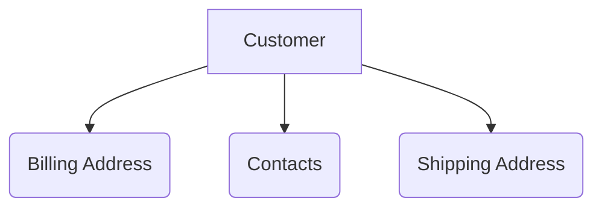

# API Management
Equipped with our services and open API platform, we provide you the chance to reach, test and use Sherwin’s digital services. Using these, you now have the power of Sherwin supporting you to develop the next generation of applications. Check out how you can do it;

If you already have an account, you can proceed to use the API provided by Sherwin. Else follow the steps below to create an account.
https://swdemoaccount.stoplight.io/docs/swcustomer/branches/main/3d67f318f9c78-add-customer

# Customer

The customer hub holds details about customers doing business with Sherwin, information such as their contact details,
shipping and billing address, sales order history, terms and conditions etc.
The customer repository also holds information on the status of a customer's account, bank detatils and payment information.
Having the customer account makes it easier to extract the information that you are looking for.
You can use the Customer API to check whether a customer has an active account or create one if you need.

Sensitive information like the bank details are not displayed, they need to be keyed in if required.

<!-- theme: warning -->

> All endpoints can be either secured using Basic, API Key or OAuth2 authentication



## The Account Details

Customer account is a unique identifier. Knowing your account number makes it easier to use the APIs.
The API fetches information regarding your customer details registered with Sherwin, shipping and billing address, payment details,
sales person information etc.

You can also create an account if you do not have one already.

For security reasons, sensitive information like the credit card details will not be shared.

<br>

### _/customerdtls_

- ### GET

Properties

- _Parameter Name_ : \[Name]
- _Parameter Type_ : Query/Path
- _Data Type_      : \[Integer/String/Boolean]

#### Request

```bash
curl -X 'GET' \
  'https://swdemoaccount.stoplight.io/SWHackathon2022/SWCustomerAPI/1.0.0/customerdtls?ouId=xxxxx \
  -H 'accept: application/json'
```

#### Response

<!--
type: tab
title: Example
-->

```json
{
    "AccountId": 1,
    "OUId": 1,
    "OUName": "SWMY CL OU",
    "AccountNumber": "1001",
    "CustName": "MALPLAST INDUSTRIES",
    "Billing_Info": {
      "Primary": true,
      "BillSiteId": 101,
      "BillLocaName": "Billing Location Name1",
      "BillAddress": "Billing Address1"
    },
    "Shipping_Info": {
      "Primary": true,
      "ShippSiteId": 102,
      "ShipLocName": "Shipping Location Name1",
      "ShippAddress": "Shipping Address1"
    }
  }
```

<!--
type: tab
title: Schema
-->

```yaml
Custaccountinfo:
      required:
        - AccountId
      type: object
      properties:
        AccountId:
          type: integer
          format: int32
        OUId:
          type: integer
          format: int32
        OUName:
          type: string
        AccountNumber:
          type: string
        CustName:
          type: string
        Billing_Info:
          $ref: '#/components/schemas/Custaccountinfo_Billing_Info'
        Shipping_Info:
          $ref: '#/components/schemas/Custaccountinfo_Shipping_Info'
```

<!-- type: tab-end -->

- ### POST

#### Request

<!--
type: tab
title: Example
-->

```bash
curl -X 'POST' \
  'https://virtserver.swaggerhub.com/SWHackathon2022/SWCustomerAPI/1.0.0/customeraccountdtls' \
  -H 'accept: application/json' \
  -H 'Content-Type: application/json' \
  -d '{
  "OUId": [xxxx],
  "CustName": [Test Customer1],
  "BillAddress": [Test Customer Bill Address],
  "ShipAddress": [Test Customer1 Shipping Address]
}'
```

<!--
type: tab
title: Schema
-->

```yaml
NewCustomer:
      required:
        - CustName
      type: object
      properties:
        OUId:
          type: integer
          format: int32
        CustName:
          type: string
        BillAddress:
          type: string
        ShippAddress:
          type: string
```

<!-- type: tab-end -->

#### Response

<!--
type: tab
title: Example
-->

```json
{
    "AccountId": 1,
    "OUId": 1,
    "OUName": "SWMY CL OU",
    "AccountNumber": "1001",
    "CustName": "MALPLAST INDUSTRIES",
    "Billing_Info": {
      "Primary": true,
      "BillSiteId": 101,
      "BillLocaName": "Billing Location Name1",
      "BillAddress": "Billing Address1"
    },
    "Shipping_Info": {
      "Primary": true,
      "ShippSiteId": 102,
      "ShipLocName": "Shipping Location Name1",
      "ShippAddress": "Shipping Address1"
    }
  }
```

<!--
type: tab
title: Schema
-->

```yaml
Custaccountinfo:
      required:
        - AccountId
      type: object
      properties:
        AccountId:
          type: integer
          format: int32
        OUId:
          type: integer
          format: int32
        OUName:
          type: string
        AccountNumber:
          type: string
        CustName:
          type: string
        Billing_Info:
          $ref: '#/components/schemas/Custaccountinfo_Billing_Info'
        Shipping_Info:
          $ref: '#/components/schemas/Custaccountinfo_Shipping_Info'
```

<!-- type: tab-end -->

<hr>
<br>

### _/customerdtls/{custAccountId}_

- ### GET

Properties

- _Parameter Name_ : \[Name]
- _Parameter Type_ : Query/Path
- _Data Type_      : \[Integer/String/Boolean]

#### Request

```bash
curl -X 'GET' \
  'https://swdemoaccount.stoplight.io/SWHackathon2022/SWCustomerAPI/1.0.0/customeraccountdtls/xxx' \
  -H 'accept: application/json'
```

#### Response

<!--
type: tab
title: Example
-->

```json
{
    "AccountId": 1,
    "OUId": 1,
    "OUName": "SWMY CL OU",
    "AccountNumber": "1001",
    "CustName": "MALPLAST INDUSTRIES",
    "Billing_Info": {
      "Primary": true,
      "BillSiteId": 101,
      "BillLocaName": "Billing Location Name1",
      "BillAddress": "Billing Address1"
    },
    "Shipping_Info": {
      "Primary": true,
      "ShippSiteId": 102,
      "ShipLocName": "Shipping Location Name1",
      "ShippAddress": "Shipping Address1"
    }
  }
```

<!--
type: tab
title: Schema
-->

```yaml
Custaccountinfo:
      required:
        - AccountId
      type: object
      properties:
        AccountId:
          type: integer
          format: int32
        OUId:
          type: integer
          format: int32
        OUName:
          type: string
        AccountNumber:
          type: string
        CustName:
          type: string
        Billing_Info:
          $ref: '#/components/schemas/Custaccountinfo_Billing_Info'
        Shipping_Info:
          $ref: '#/components/schemas/Custaccountinfo_Shipping_Info'
```

<!-- type: tab-end -->
